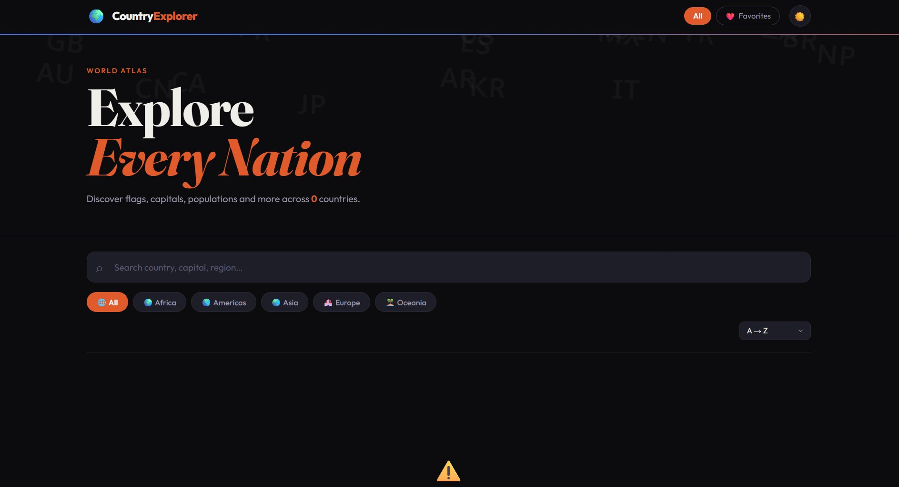

# 🌍 Country Explorer

> A beautifully designed world atlas — search, filter, and explore every nation on Earth.

🔗 **Live Demo → [pujanrasaili.github.io/country-explorer](https://pujanrasaili.github.io/country-explorer)**

---

## 🖥️ Preview

### 🌙 Dark Mode


### ☀️ Light Mode


---

## ✨ Features

- 🔍 **Smart Search** — instant results with dropdown suggestions and highlighted matches
- 🌐 **Region Filter** — Africa, Americas, Asia, Europe, Oceania
- 🔃 **Sort** — by name A→Z, Z→A, population, or area
- ❤️ **Favorites** — save countries and view them in a dedicated tab (persisted in localStorage)
- 🌙 **Dark / Light Mode** — toggle with one click, preference saved
- 💀 **Skeleton Loading** — smooth loading animation while data fetches
- 🎨 **Region Color Accents** — each card has a color based on its region
- 📱 **Fully Responsive** — works great on mobile and desktop

---

## 🛠️ Tech Stack

| Technology | Purpose |
|------------|---------|
| **HTML5** | Semantic structure |
| **CSS3** | Custom properties, animations, responsive grid |
| **Vanilla JavaScript** | Fetch, filter, sort, modal, localStorage |
| **[REST Countries API](https://restcountries.com)** | Live country data |
| **[Fraunces](https://fonts.google.com/specimen/Fraunces)** + **[Outfit](https://fonts.google.com/specimen/Outfit)** | Typography |

Zero frameworks. Zero dependencies. Pure HTML/CSS/JS.

---

## 📁 Project Structure

```
country-explorer/
├── index.html        # App structure and markup
├── style.css         # All styles — dark/light themes, animations, layout
├── script.js         # Fetch, filter, sort, modal, favorites, suggestions
├── preview-dark.png  # Dark mode screenshot
├── preview-light.png # Light mode screenshot
└── README.md         # You're reading it!
```

---

## 🚀 Run Locally

```bash
# Clone the repo
git clone https://github.com/pujanrasaili/country-explorer.git
cd country-explorer

# Start a local server (required for API fetch)
npx serve .
```

Open **[http://localhost:3000](http://localhost:3000)** in your browser.

> ⚠️ Always use a local server. Opening `index.html` directly as a `file://` URL blocks the API fetch.

---

## 🌐 API

Data from the free **[REST Countries API v3.1](https://restcountries.com)** — no API key required.

---

Made with ❤️ by **[Pujan Rasaili](https://github.com/pujanrasaili)**
